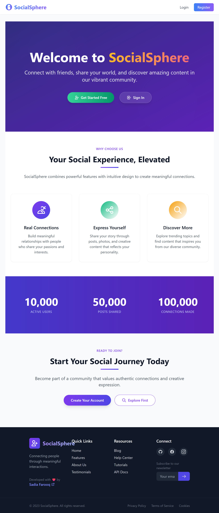
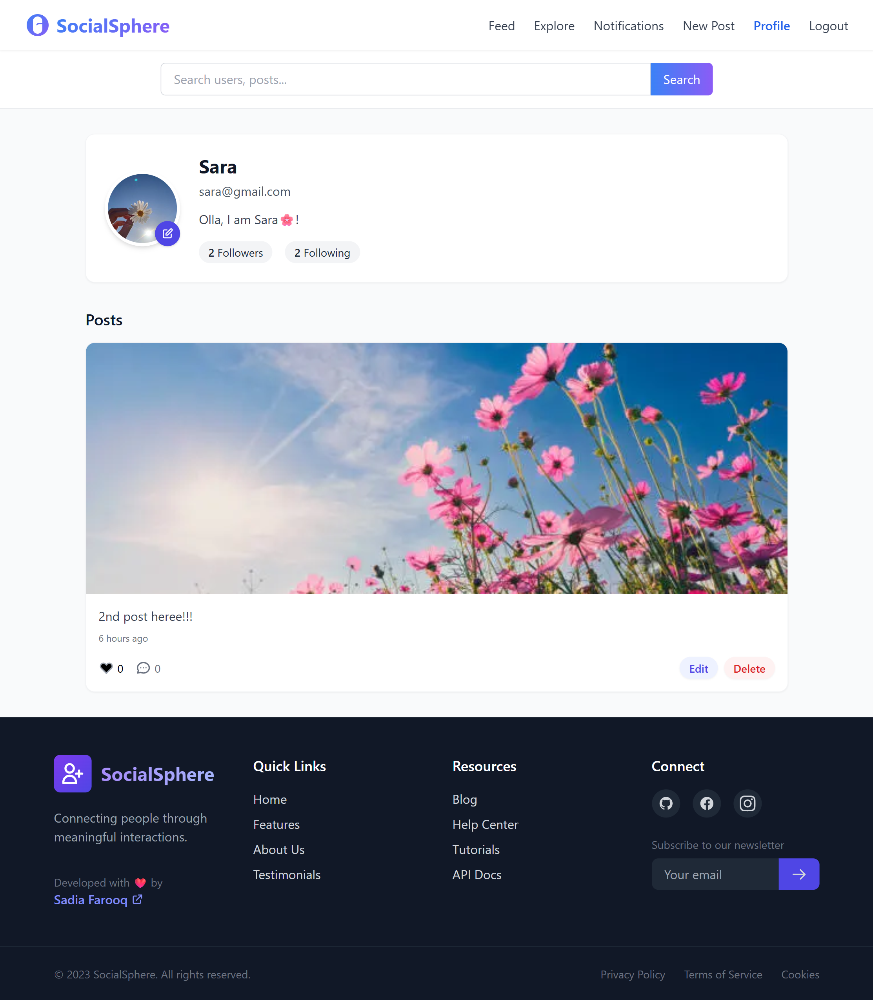
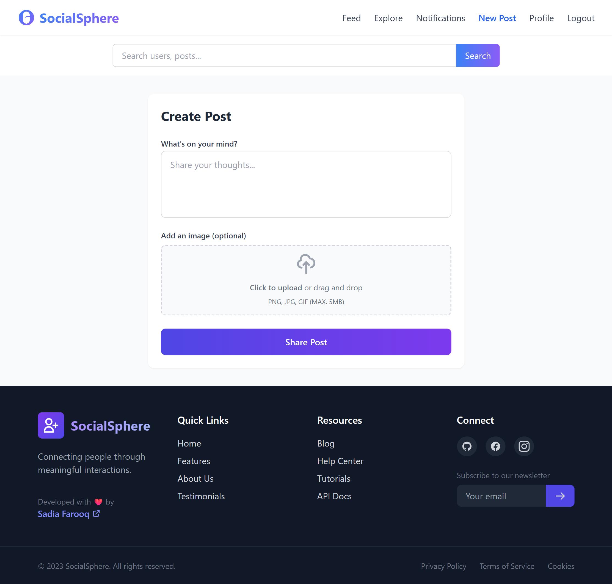
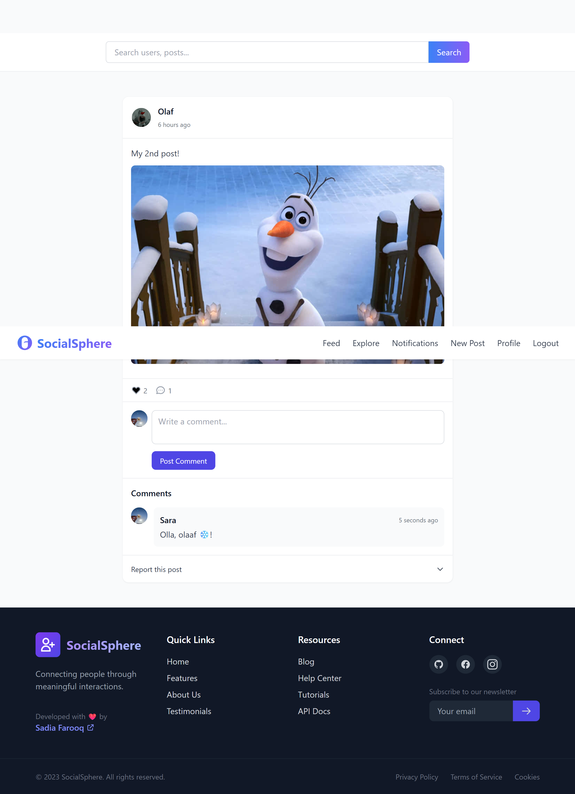
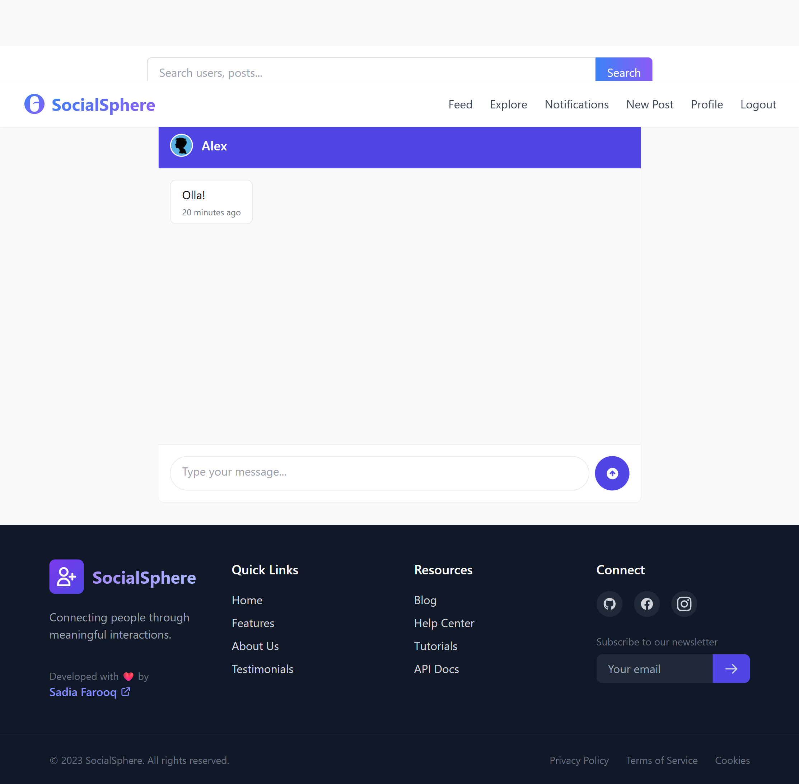
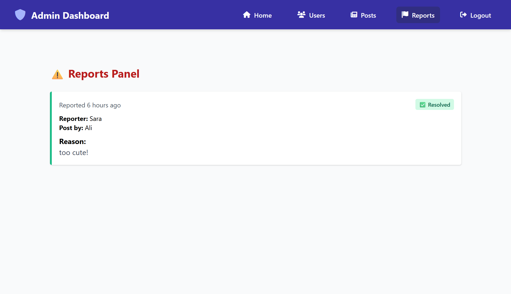
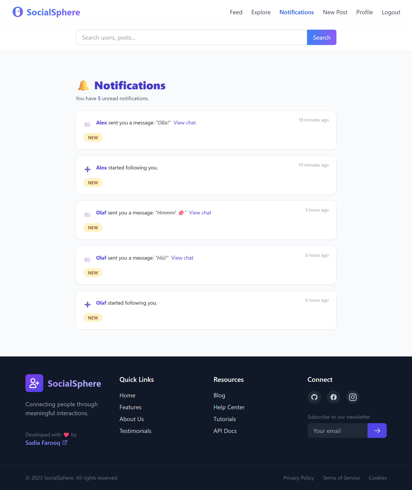

# Social-Platform-in-Django
SocialSphere — A Scalable Social Media Platform

A fully functional, visually modern **social media web app** built with Django. This platform supports everything from user profiles and direct messages to post likes, comments, and an admin moderation panel.



---

## 🚀 Features

### 👥 User System
- Profile creation and editing (bio, profile picture, email)
- Followers/Following system
- Clickable usernames linking to profiles
- Join date display
- Custom user model with extended fields



---

### 📝 Posts
- Create posts with text + optional image
- Displayed on feed, profile, and explore pages
- Like posts with ❤️ icon (real-time count)
- Inline comment system
- Edit/Delete own posts
- Humanized timestamps
- Post counts on profile



---

### 💬 Comments
- Add and display comments inline
- Humanized timestamps
- Graceful handling of no comments



---

### ❤️ Likes
- Like button on all posts
- Live like count via Django ORM
- Many-to-many relationship
- (Future: "Liked by you" UI badge)

---

### ✉️ Messaging
- DM system between users
- Threaded conversation view
- Time-stamped messages



---

### 🛡️ Reporting & Moderation
- Report inappropriate posts
- Prevent duplicate reports
- Admin panel for resolving reports
- Status display & user feedback



---

### 🧑‍💼 Admin Dashboard
- View all reports
- Resolve with a single click
- Flash message confirmations
- Staff-only access protected


---

### 🔐 Authentication & Access Control
- Secure Login / Logout
- Restriction based on roles (owner-only edit/delete, staff-only admin)
- CSRF protection on all POST forms

---

### 🎨 UX & Frontend
- Responsive layout with Tailwind CSS-inspired utility classes
- Clean modular templates
- Toast messages using Django’s `messages` framework
- Dynamic navbar, reusable footer

---


---

## 💡 Why This Project Matters

This project is more than a basic app — it's a **scalable social framework** that can evolve into:

- 🔍 Discussion forums
- 🧑‍🏫 Teaching real-world Django
- 🛠 Prototypes for clients/portfolio
- 💬 Niche communities (e.g. fandoms, clubs)

---

## 📸 More Screenshots

| Explore Page | Feed Page | Notifications | Search |
|--------------|-----------|---------------|--------|
|  |  |  |  |

---

## 🧪 Future Improvements
- Nested comment threads
- Real-time notifications via Channels
- Profile bio links
- Profile cover photo
- Theme toggle (dark/light)

---

## 📦 Installation (for local setup)

```bash
git clone https://github.com/Saddia149/Social-Platform-in-Django.git
cd Social-Platform-in-Django
python -m venv venv
source venv/bin/activate  # On Windows: venv\Scripts\activate
pip install -r requirements.txt
python manage.py migrate
python manage.py runserver

